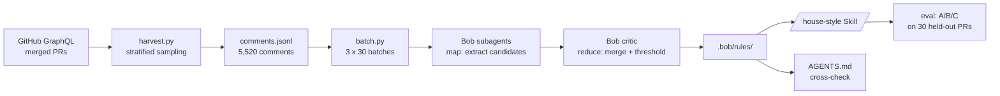

# House Style

**Mines the unwritten code-review conventions of a repository out of its merged-PR history, and gives them back as an enforceable IBM Bob Skill that cites the reviews it learned from.**

Built for the IBM TechXchange 2026 Pre-conference Dev Day Hackathon.

---

## The problem

Every mature codebase has two rulebooks. One is written down — the linter config, the contributing guide, the `AGENTS.md`. The other lives in the heads of three or four senior reviewers, and it only surfaces when someone violates it in a pull request.

That second rulebook is where the expensive review time goes. It is not formatting; CI already catches that. It is *"cursor tokens that fail to parse must raise HTTP 400, not fall back to the raw string"* and *"new execution-API endpoints need a `.didnt_exist` entry in the unreleased Cadwyn version file."* New contributors cannot know these. Reviewers retype them. Nobody writes them down, because nobody has the whole list — each reviewer holds a different fragment.

The AI coding tools that were supposed to help make this worse. Every team now hand-writes an `AGENTS.md` or `CLAUDE.md` full of guessed conventions, with no evidence behind any line and no way to tell which entries reflect what the team actually enforces.

## What it does

House Style reads a repository's merged-PR review history, distils the conventions reviewers actually enforce, and emits them two ways:

- **`.bob/rules/*.md`** — a human-readable, editable rulebook, each rule carrying the PRs that justify it
- **`/house-style`** — an IBM Bob Skill that reviews a diff against those rules

Every finding cites precedent:

```
[airflow-r014] api_fastapi/core_api/routes/public/task_instances.py:212  api-design
Fetch limit+1 rows so next_cursor can be null on the last page.
Why: computing next_cursor from the last item makes it non-null even when
     no further rows exist, breaking the pagination contract.
Precedent: PR #64845, PR #64963, PR #63994  (support: 3 reviews)
```

A reviewer who disagrees deletes the rule and commits. The rulebook is a text file, not a black box.

## Pipeline



## Quickstart

```bash
uv sync
export GITHUB_TOKEN=ghp_...

# 1. Harvest — stratified across 12 months, pre-qualified to PRs with >=3 review threads,
#    30 most-recent qualified PRs fenced off as holdout
python -m harvest.harvest --repo apache/airflow --months 12
python backfill_bodies.py --repo apache/airflow

# 2. Batch into tranches
python -m distill.batch --repo apache-airflow

# 3. Distil — map subagents over batches, then the chunked critic and merge.
#    Prompts are files: distill/prompts/. Full command sequence in docs/pipeline.md.
python -m distill.critic verify --candidates distill/candidates    # evidence resolves?
python -m distill.critic reduce --slug airflow --tranche 1 \
    --candidates distill/candidates/t1 \
    --clusters distill/critic/t1/clusters_merged.json

# 4. Review a diff
/house-style --diff main
```

**[docs/pipeline.md](docs/pipeline.md) is the full runbook** — every command from an empty
checkout to a scored evaluation, including the cross-check, the eval harness and the
dashboard.

## Repo layout

```
harvest/harvest.py        GraphQL harvester, stratified + pre-qualified sampling
backfill_bodies.py        recovers full comment bodies from the GitHub REST API
distill/batch.py          stratified tranche construction, topical batching
distill/critic.py         the reduce — support counts, scope generalisation, stable ids
distill/crosscheck.py     mined rules vs hand-written AGENTS.md, both directions
distill/fetch_docs.py     read-only fetch of the target repo's own documentation
distill/prompts/          the subagent prompts, versioned as files
.bob/rules/               generated rulebooks + cross-check (committed)
.bob/skills/house-style/  the review Skill, and its deterministic scaffolding
eval/                     A/B/C harness, watsonx.ai Granite judge, reviewer prompts
dashboard/                Next.js viewer for rules, evidence and results
bob_sessions/             Bob task session summaries (submission deliverable)
data/                     gitignored working storage
docs/pipeline.md          the full command-by-command runbook
docs/bob_prompts.md       the phase-by-phase prompt pack and completion notes
```

## Where the numbers come from

The pipeline draws one line hard: **agents make judgement calls, code does arithmetic.**

A subagent decides whether two review comments express the same expectation — that is
taste, and no script can do it. But it never emits a support count, a scope path or an
evidence list. It emits *clusters of candidate keys*, and `distill/critic.py` resolves each
key against the harvested corpus, counts distinct PRs, and applies the threshold.

That split is not ceremony. A support count asserted by a language model is a number nobody
can check, and it is the number the promotion threshold acts on. Enforcing it in code also
caught something prose never would: **7 of 912 evidence permalinks did not resolve to any
harvested comment** — transcription slips, a digit wrong in a URL. They are dropped rather
than counted, because a finding whose precedent does not resolve is not a finding.

## Their AGENTS.md, checked against their own review history

Apache Airflow ships a hand-written `AGENTS.md`. We compared it against a year of review
history in both directions. Full detail in
[`.bob/rules/airflow-agents-md-crosscheck.md`](.bob/rules/airflow-agents-md-crosscheck.md).

**Are the mined rules documented anywhere?** Of the 26 mined rules:

| | Rules | |
|---|---|---|
| CONFIRMED | 7 (27%) | stated in `AGENTS.md` or contributing-docs |
| IMPLIED | 7 (27%) | the docs gesture at it without requiring it |
| **TRIBAL** | **12 (46%)** | **documented nowhere; lives only in review history** |

CONFIRMED is the correctness check — mining found these independently, from review
comments alone. TRIBAL is the product, and **its share grew** when a second tranche
doubled the corpus (36% → 46%): the more review history you read, the more undocumented
convention surfaces.

A sample of what "tribal" means here — none of these is a generic lint:

> `airflow-r423` — In `execute_complete`, branch explicitly on `event["status"]` and
> handle every status the paired trigger can emit — success, error, timeout and
> cancelled — before reading any payload field. *(support: 4 PRs)*

> `airflow-r418` — Keep FastAPI route modules to route handlers only: Pydantic models
> belong in datamodels, authorization helpers in services, query construction in the
> `Query*` filter's `to_orm`. *(support: 4 PRs)*

> `airflow-r426` — Post-submit cleanup belongs in a `try/finally` covering the whole
> method including its early-exit guards, so it runs on success, failure and kill alike.
> *(support: 3 PRs)*

**Does review history support their hand-written rules?** Of the 43 concrete,
checkable requirements stated in Airflow's `AGENTS.md`:

| | Rules |
|---|---|
| SUPPORTED | 17 (40%) |
| **UNSUPPORTED** | **24 (56%)** |
| CONTRADICTED | 2 (5%) |

**UNSUPPORTED does not mean wrong**, and the report says so for each one. A rule can go
unsupported because nobody ever violates it (`No assert in production code`), because
tooling fixes it before a human ever sees it (`ruff format`), or because our evidence
source cannot see it at all (commit-message rules — we mine line-level review comments).
Separating those is the point; without this comparison nobody could tell you which of
their own entries is which.

### The sharpest finding: a rule that is right and wrong at once

`AGENTS.md` states flatly: **"Never add new direct `raise AirflowException(...)`."**

Review history says the repository enforces *both directions*, split by surface:

- `airflow-r436` (support 3) confirms it for **provider** validation and third-party
  errors — reviewers ask for built-in `ValueError`/`TypeError` there.
- `airflow-r425` (support 3, PRs
  [#64119](https://github.com/apache/airflow/pull/64119),
  [#64051](https://github.com/apache/airflow/pull/64051),
  [#56936](https://github.com/apache/airflow/pull/56936)) contradicts it for **operator,
  sensor and trigger error paths**, where reviewers explicitly demanded
  `AirflowException` / `AirflowFailException` / `AirflowTaskTimeout` and rejected
  `RuntimeError`.

`AGENTS.md` admits no such carve-out. A contributor following it to the letter on a
trigger's timeout branch will be asked to change it in review. This is precisely the class
of thing a hand-written rules file cannot tell you about itself — the exception only
exists in the history.

A second, quieter version of the same problem: `airflow-r435` (guard optional provider
imports behind `try/except ImportError`) is TRIBAL, and the nearest documentation
*assumes the anti-pattern* — `12_provider_distributions.rst` tells providers to make an
unguarded top-level import work by injecting `sys.modules[...] = MagicMock()` in conftest.

The other CONTRADICTED entry: `AGENTS.md` says never add newsfragments for `providers/`,
but a reviewer on [#63614](https://github.com/apache/airflow/pull/63614) asked a provider
PR for exactly that file. That one rests on a single below-threshold observation and is
flagged as such in the report rather than overstated.

## Results

Measured on **30 held-out PRs**, excluded from mining and each carrying at least three real review threads, so every one has ground truth to score against.

The corpus: **5,520 review comments** across 722 merged PRs, stratified over 12 months.
Tranche 1 distilled to **14 rules** (499 candidates → 419 clusters → 14 promoted at
support ≥ 3, plus 344 below-threshold candidates and 58 one-off incidents). The Home
Assistant contrast corpus yielded **27 rules** from 375 candidates.

All three conditions ran the full 30 held-out PRs — 90 reviews, 43 judged pairs.

| Condition | Findings | Findings/PR | Strict matches | Lenient recall | Lenient precision |
|---|---|---|---|---|---|
| A — stock review, no mined rules | 72 | 2.40 | **4** | 4.4% | 12.5% |
| B — House Style, Airflow rules | 12 | 0.40 | **0** | 0.5% | 8.3% |
| C — House Style, **Home Assistant** rules on Airflow PRs | 11 | 0.37 | **0** | 0.0% | 0.0% |

### The mined rules did not beat the baseline

Stated plainly, because it is the result: **condition A anticipated more real human
comments than condition B.** All four strict matches went to the reviewer with *no* mined
rules. The project's central claim — that mining a repository's review history produces
better review than stock review of the same diffs — **is not supported by this
evaluation.**

A caveat that cuts against reading too much into A's win, raised by the judge itself: four
of A's judged pairs are the *same finding* matched against four different comments in one
`airflow_health.py` thread. On a per-finding basis one baseline finding landed well and
most did not. Neither condition demonstrates much here.

The obvious explanation was that the rulebook was too small. **We tested that and it was
wrong.** A second tranche was distilled, taking the rulebook from 14 rules to 26 and the
median applicable rules per PR from 7 to 14, and condition B was re-run from scratch:

| | 14-rule book | 26-rule book |
|---|---|---|
| median applicable rules per PR | 7 | 14 |
| findings | 12 | 12 |
| strict matches | 0 | 0 |
| lenient matches | 1 | 1 |

Twice the rules, twice the rules in scope, identical outcome. A broader set fired (6
distinct rules rather than 4), so the rulebook genuinely changed — the result did not.

That points at the harder conclusion: **rules mined from what reviewers *did* flag do not
predict what they *will* flag next.** Much of code review is a specific maintainer
noticing a specific thing, and it is not convention at all.

This does not make the rulebook worthless, and the distinction matters. Phase 3 shows it
contains real, evidenced, undocumented conventions — and the reviewer agents repeatedly
noted diffs that *complied* with a rule (correctly guarded optional imports, every trigger
status handled, the explanatory comment a rule asks for already present). **The mined
rulebook is a documentation artifact and a review checklist, not a predictor of the next
review comment.** That is a narrower claim than the project set out to make, and it is the
one the evidence supports.

What the evaluation *does* support: **the rules are genuinely repo-specific.** Condition C
matched nothing, and only 4 of 27 Home Assistant rules fired on Airflow at all — the four
framework-neutral ones. Whatever the Airflow rulebook is doing, it is not detecting generic
Python smells. The Phase 3 cross-check stands on its own evidence and is unaffected by any
of this.

Condition A isolates the lift as coming from the mining rather than the model. Here it
shows there was no lift.

**Condition C is the ablation, and it runs deliberately unscoped.** With the Skill's
normal scope filter on, C scores zero for an uninteresting reason: Home Assistant's scope
paths (`homeassistant/components/…`) cannot intersect Airflow's tree, so **all 27 rules
are rejected before their content is ever examined** — 0 applicable rules on all 30
held-out PRs. That is a real result about path specificity, but it proves only that the
*paths* differ. So C is scored with scope filtering disabled, offering every Home
Assistant convention against every Airflow diff, which asks the question worth asking: do
those conventions actually fire on another repository's code?

Semantic equivalence between a generated finding and a real human comment is judged by
**IBM Granite via watsonx.ai**, with every verdict cached to `eval/cache/`. An agent-judge
backend working from the identical rubric covers the case where watsonx credentials are
absent; both write the same cache, so adding credentials later fills in the rest without
re-judging anything.

**Ground truth** is 203 real human review comments across the 30 held-out PRs, fetched
after mining and never seen by the miner.

### Two things the numbers cannot be read without

**Recall is capped by a prompt decision, not by rule quality.** Both reviewer prompts say
*prefer silence* — report only what a human would actually comment on. That is the right
instinct for a tool people have to live with, but it caps recall arithmetically: a
reviewer emitting ~0.4 findings per PR cannot match 203 comments however good those
findings are. `eval/results.json` reports a `recall_ceiling` next to recall for exactly
this reason. The instruction is identical in both prompts, so the *comparison* is
unaffected; only the absolute scale is.

**Thirty PRs do not exercise a whole rulebook.** The rules that fired are the ones the
project already documents. No TRIBAL rule fired — the undocumented conventions are the
product, but they are also rarer, and 30 PRs is too small a sample to meet most of them.
That is a limit of the evaluation's size, not evidence about those rules.

## How IBM Bob is used

Bob is the engine, not the scaffolding.

- **Subagents + parallel tasks** — distillation is a map-reduce over ~5,500 review comments, which does not fit in any context window. One subagent per 25-comment batch extracts candidates; a chunked critic pass merges duplicates, computes support from distinct PRs, and applies the promotion threshold. Tranches run as concurrent Bob tasks.
- **Document understanding** — Bob reads Airflow's hand-written `AGENTS.md` and `contributing-docs/` and cross-checks every mined rule against them in both directions.
- **Skills** — the deliverable is a Bob Skill, so the output lands in the IDE the developer already has open. No new tool to adopt.
- **Custom rules** — the generated rulebook is loaded as project rules, and privacy constraints were enforced as rules rather than by hand.
- **Agent mode** — the harvester, backfiller, batcher, eval harness and dashboard were all built in Bob.

Session summaries for every task are in `bob_sessions/`.

## Data compliance

- Both mined repositories are **Apache-2.0**; source list and license SPDX ids are recorded in each `data/<repo>/manifest.json`.
- **No personal information is stored.** Reviewer logins are hashed (`sha256[:12]`) everywhere, including gitignored working storage.
- **No comment text is committed.** `data/` holds full bodies as working material and is gitignored; committed artifacts carry a comment URL and at most a 15-word excerpt.
- No client data, no confidential data, no social-media data.

## Known limitations

Named here rather than left for a reader to find:

- Three PRs exceeded the `reviewThreads(first: 50)` GraphQL page and were truncated. Raising the page size would double point cost across ~1,500 fetches to recover roughly 1% of threads.
- The anti-domination cap is computed against the qualified pool rather than the selected set, so its effective ceiling is ~44% rather than the intended 35%. It errs toward `airflow-core`, which is the direction we want.
- Rules are mined from what reviewers *commented on*. A convention so well understood that nobody ever violates it leaves no trace in review history and is invisible to this method.
- Precision is measured against what a human reviewer actually wrote, which is a subset of what they noticed. A correct finding a reviewer did not bother to make scores as a false positive.

## License

Apache-2.0. Mined repositories are the property of their respective projects; House Style stores only URLs, short excerpts, and derived rules.