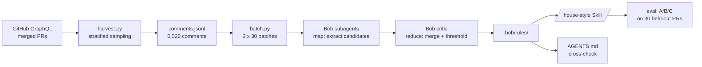

# House Style

**Mines the unwritten code-review conventions of a repository out of its merged-PR history, and gives them back as an enforceable IBM Bob Skill that cites the reviews it learned from.**

Built for the IBM TechXchange 2026 Pre-conference Dev Day Hackathon.

---

## The problem

Every mature codebase has two rulebooks. One is written down — the linter config, the contributing guide, the `AGENTS.md`. The other lives in the heads of three or four senior reviewers, and it only surfaces when someone violates it in a pull request.

That second rulebook is where the expensive review time goes. It is not formatting; CI already catches that. It is *"cursor tokens that fail to parse must raise HTTP 400, not fall back to the raw string"* and *"new execution-API endpoints need a `.didnt_exist` entry in the unreleased Cadwyn version file."* New contributors cannot know these. Reviewers retype them. Nobody writes them down, because nobody has the whole list — each reviewer holds a different fragment.

The AI coding tools that were supposed to help make this worse. Every team now hand-writes an `AGENTS.md` or `CLAUDE.md` full of guessed conventions, with no evidence behind any line and no way to tell which entries reflect what the team actually enforces.

## What it does

House Style reads a repository's merged-PR review history, distils the conventions reviewers actually enforce, and emits them two ways:

- **`.bob/rules/*.md`** — a human-readable, editable rulebook, each rule carrying the PRs that justify it
- **`/house-style`** — an IBM Bob Skill that reviews a diff against those rules

Every finding cites precedent:

```
[airflow-r014] api_fastapi/core_api/routes/public/task_instances.py:212  api-design
Fetch limit+1 rows so next_cursor can be null on the last page.
Why: computing next_cursor from the last item makes it non-null even when
     no further rows exist, breaking the pagination contract.
Precedent: PR #64845, PR #64963, PR #63994  (support: 3 reviews)
```

A reviewer who disagrees deletes the rule and commits. The rulebook is a text file, not a black box.

## Pipeline



## Quickstart

```bash
export GITHUB_TOKEN=ghp_...

# 1. Harvest — stratified across 12 months, pre-qualified to PRs with >=3 review threads
python -m harvest.harvest --repo apache/airflow --months 12

# 2. Backfill full comment bodies (one paginated REST call per PR)
python backfill_bodies.py --repo apache/airflow

# 3. Batch into tranches
python -m distill.batch --repo apache/airflow

# 4. Distil — in Bob IDE, run the prompts in docs/bob_prompts.md (Phase 2b)

# 5. Review a diff
/house-style --diff main
```

## Repo layout

```
harvest/harvest.py        GraphQL harvester, stratified + pre-qualified sampling
backfill_bodies.py        recovers full comment bodies from the GitHub REST API
distill/batch.py          stratified tranche construction, topical batching
.bob/rules/               generated rulebook + AGENTS.md cross-check (committed)
.bob/skills/house-style/  the review Skill
eval/                     A/B/C harness, watsonx.ai semantic judge
dashboard/                Next.js viewer for rules, evidence and results
bob_sessions/             Bob task session summaries (submission deliverable)
data/                     gitignored working storage
docs/bob_prompts.md       the phase-by-phase Bob prompt pack
```

## Results

Measured on **30 held-out PRs**, excluded from mining and each carrying at least three real review threads, so every one has ground truth to score against.

| Condition | Recall | Precision | Findings/PR |
|---|---|---|---|
| A — stock Bob `/review`, no mined rules | _TBD_ | _TBD_ | _TBD_ |
| B — House Style, Airflow rules | _TBD_ | _TBD_ | _TBD_ |
| C — House Style, **Home Assistant** rules on Airflow PRs | _TBD_ | _TBD_ | _TBD_ |

Condition A isolates the lift as coming from the mining rather than the model. **Condition C is the ablation that matters**: both repos are large async Python infrastructure projects, so if C scored near B we would only be detecting generic Python smells.

Semantic equivalence between a generated finding and a real human comment is judged by **IBM Granite via watsonx.ai**, with every verdict cached.

**Rule discovery saturation** — _TBD_: new-rule rate by tranche, showing the point at which additional corpus stops yielding new conventions.

## How IBM Bob is used

Bob is the engine, not the scaffolding.

- **Subagents + parallel tasks** — distillation is a map-reduce over ~5,500 review comments, which does not fit in any context window. One subagent per 25-comment batch extracts candidates; a chunked critic pass merges duplicates, computes support from distinct PRs, and applies the promotion threshold. Tranches run as concurrent Bob tasks.
- **Document understanding** — Bob reads Airflow's hand-written `AGENTS.md` and `contributing-docs/` and cross-checks every mined rule against them in both directions.
- **Skills** — the deliverable is a Bob Skill, so the output lands in the IDE the developer already has open. No new tool to adopt.
- **Custom rules** — the generated rulebook is loaded as project rules, and privacy constraints were enforced as rules rather than by hand.
- **Agent mode** — the harvester, backfiller, batcher, eval harness and dashboard were all built in Bob.

Session summaries for every task are in `bob_sessions/`.

## Data compliance

- Both mined repositories are **Apache-2.0**; source list and license SPDX ids are recorded in each `data/<repo>/manifest.json`.
- **No personal information is stored.** Reviewer logins are hashed (`sha256[:12]`) everywhere, including gitignored working storage.
- **No comment text is committed.** `data/` holds full bodies as working material and is gitignored; committed artifacts carry a comment URL and at most a 15-word excerpt.
- No client data, no confidential data, no social-media data.

## Known limitations

Named here rather than left for a reader to find:

- Three PRs exceeded the `reviewThreads(first: 50)` GraphQL page and were truncated. Raising the page size would double point cost across ~1,500 fetches to recover roughly 1% of threads.
- The anti-domination cap is computed against the qualified pool rather than the selected set, so its effective ceiling is ~44% rather than the intended 35%. It errs toward `airflow-core`, which is the direction we want.
- Rules are mined from what reviewers *commented on*. A convention so well understood that nobody ever violates it leaves no trace in review history and is invisible to this method.
- Precision is measured against what a human reviewer actually wrote, which is a subset of what they noticed. A correct finding a reviewer did not bother to make scores as a false positive.

## License

Apache-2.0. Mined repositories are the property of their respective projects; House Style stores only URLs, short excerpts, and derived rules.